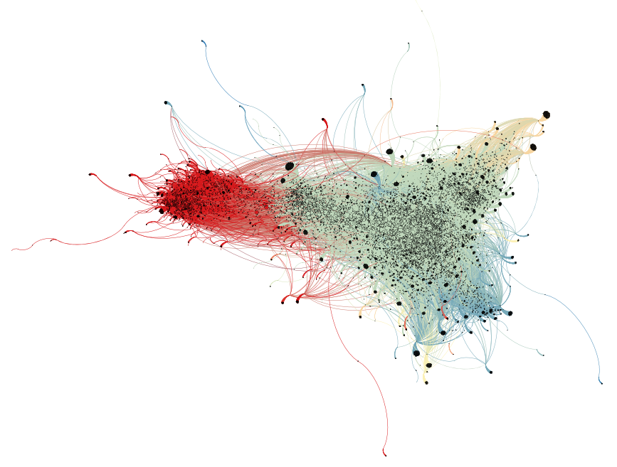

# sma-twitter-communities-analysis

This project is an assigment for Social Media Analysis course at Wroclaw Univ. of Science and Technology.

### Project goal
Prepration and analysis network of Twitter users participating in the discussion surrounding the controversy.

### Knowledge and skills scope
* understanding Twitter data
* Twitter data acquisition
* Jupyter ipython notebooks
* Python:  
	* data organization: pandas
	* graphs: networkx
	* machine learning: scikit-learn
	* NLP: polyglot 
	* scrapping: twint
* Gephi

### Project steps
1. Scrapping tweets from 19.10.2020 - 23.10.2020 with hashtag `#trybunalkonstytucyjny` which is related with controversional polish Constitutional Court decision concerning abortion.
2. Scraping all tweets of found users from 12.10.2020 - 23.10.2020.
3. Users graph building - users as nodes and edges between users if one user retweeted other user's tweet at least once (26 335 and 70 403 edges in graph).
4. Detecting communities and computing graph layout with Gephi.
5. Analysis users activities in most meaningfull communitites.
6. Performing users classification task on prepared data.

### Outcome

Performed analysis of gained communities show that two biggest groups suggest good split for Constitutional Court decision supporters and opponents:
- red coloured community - named as **Group A** in analysis - decision supporters,
- green coloured community - named as **Group B** in analysis - decision opponents.

HTML version of notebook with full **analysis is available [here](https://kornelro.github.io/sma-twitter-communities-analysis/)**.